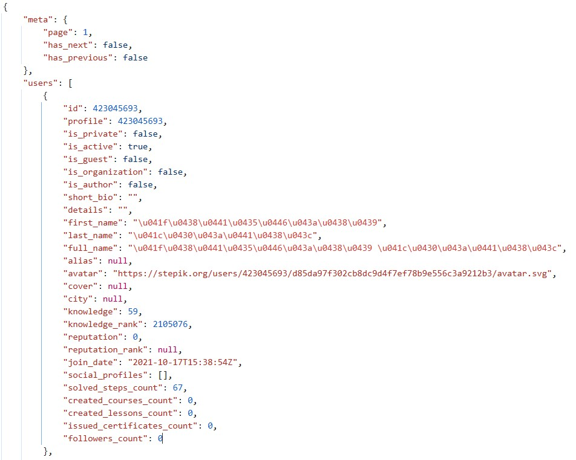
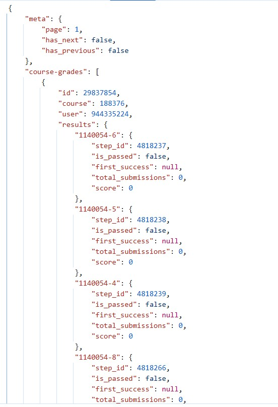
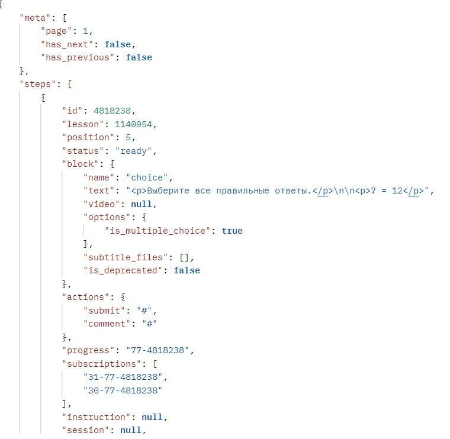
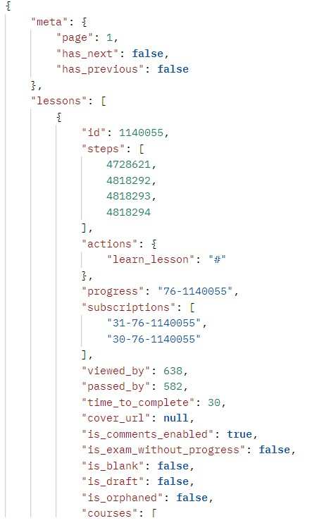
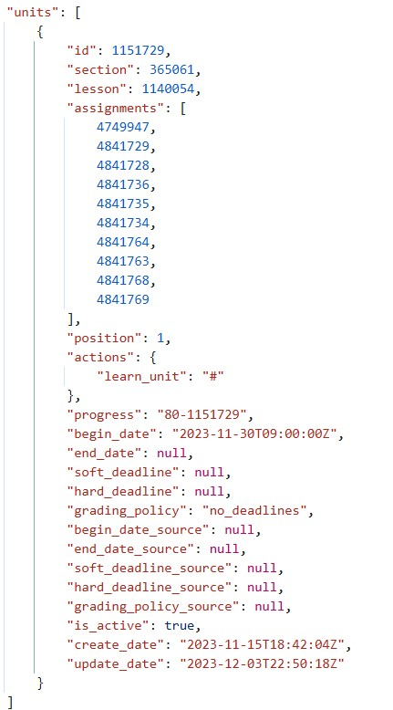
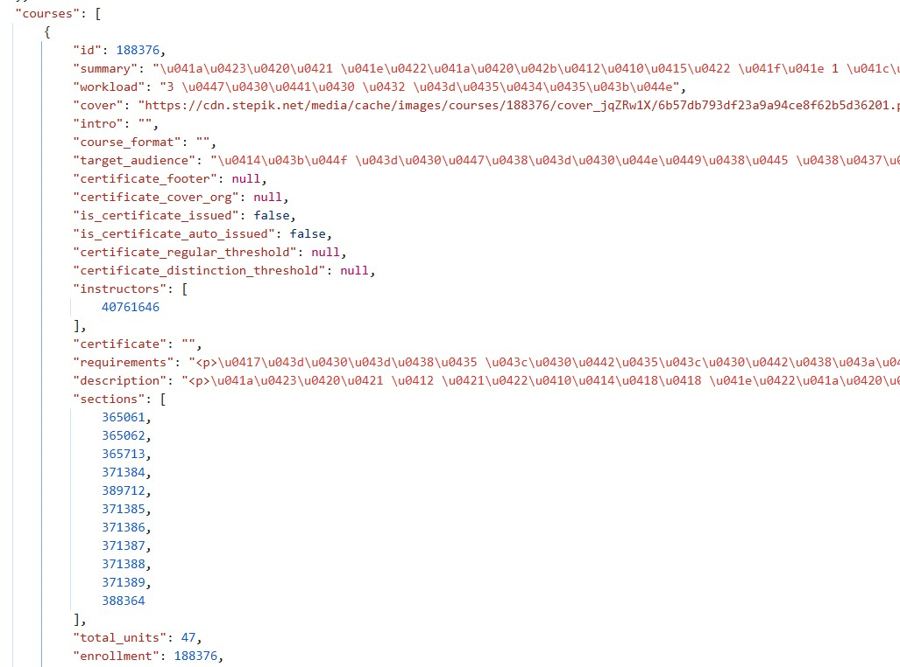
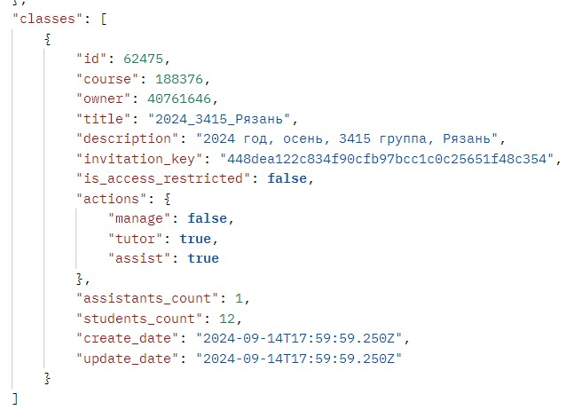

# Запросы для grade-book степика
## <u>Что знаю</u>: 
### Работа с информацией о пользователе
Структура https-запроса:
**\https://stepik.org/api/users?ids%5B%5D=user_id**
> Вместо **user_id** нужно подставить id конкретного пользователя

В json-формате мы получим словарь, в котором по ключу "user" хранится список словарей. Вид хранимого словаря:

* {   
&emsp;"id",
&emsp;"profile",
&emsp;"is_private",
&emsp;"is_active",
&emsp;"is_guest",
&emsp;"is_organization",
&emsp;"is_author",
&emsp;"short_bio",
&emsp;"details",
&emsp;"first_name",
&emsp;"last_name",
&emsp;"full_name",
&emsp;"alias",
&emsp;"avatar",
&emsp;"cover",
&emsp;"city",
&emsp;"knowledge",
&emsp;"knowledge_rank",
&emsp;"reputation",
&emsp;"reputation_rank",
&emsp;"join_date",
&emsp;"social_profiles",
&emsp;"solved_steps_count",
&emsp;"created_courses_count",
&emsp;"created_lessons_count",
&emsp;"issued_certificates_count",
&emsp;"followers_count"
}

<b> Пример: </b> 
Запрос: **\https://stepik.org/api/users?ids\%5B\%5D=944335224&ids%5B%5D=423045693**
Ответ на него

### Работа с информацией по grade-book

Мы получим все оценки всех студентов. Структура https-запроса:
**\https://stepik.org/api/course-grades?course=course_id&is_teacher=false&klass=62475&order=-score%2C-id&page=1&search=**
**course_id** - id курса

В json-формате мы получим словарь, в котором по ключу "user" хранится список словарей. Вид хранимого словаря:

<b> Пример: </b>
Запрос: **\https://stepik.org/api/course-grades?course=188376&is_teacher=false&klass=62475&order=-score%2C-id&page=1&search=**
Ответ на него

### Работа с информацией по шагу
Получить информацию по шагу можно с помощью этого https-запроса:
**\https://stepik.org/api/steps?ids%5B%5D=step_id**
> Вместо **step_id** нужно подставить id шага

В json-формате мы получим словарь, в котором по ключу "steps" хранится список словарей. Вид хранимого словаря:
* {
&emsp;"id",
&emsp;"lesson", - урок, к которому прикреплен шаг
&emsp;"position", - позиция шага в уроке, т.е. какой он по счету (1, 2, ...)
&emsp;"status",
&emsp;"block", - описан ниже
&emsp;"actions",
&emsp;"progress",
&emsp;"subscriptions",
&emsp;"instruction",
&emsp;"session",
&emsp;"instruction_type",
&emsp;"viewed_by",
&emsp;"passed_by",
&emsp;"correct_ratio",
&emsp;"worth",
&emsp;"is_solutions_unlocked",
&emsp;"solutions_unlocked_attempts",
&emsp;"has_submissions_restrictions",
&emsp;"max_submissions_count",
&emsp;"variation",
&emsp;"variations_count",
&emsp;"is_enabled",
&emsp;"needs_plan",
&emsp;"create_date",
&emsp;"update_date",
&emsp;"discussions_count",
&emsp;"discussion_proxy",
&emsp;"discussion_threads"
},

Структура block:
{
&emsp;"name", - тип урока
&emsp;"text", - текст, который сопровождает урок
&emsp;"video",
&emsp;"options",
&emsp;"subtitle_files",
&emsp;"is_deprecated"
}

<b> Пример: </b> 
Запрос: **\https://stepik.org/api/users?ids\%5B\%5D=944335224&ids%5B%5D=423045693**
Ответ на него

### Работа с информацией по уроку(lesson)
Получить информацию по уроку можно с помощью этого https-запроса:
**\https://stepik.org/api/lessons?ids%5B%5D=lesson_id**
> Вместо **lesson_id** нужно подставить id урока

В json-формате мы получим словарь, в котором по ключу "lessons" хранится список словарей. Вид хранимого словаря(большинство ключей пропущено, т.к. нам они не нужны):
* {
&emsp;"id",
&emsp;"steps", - список шагов в уроке 
&emsp;"courses", - список курсов, где вставлен этот урок
&emsp;"units", - список юнитов, где вставлен этот урок
&emsp;"title", - название
&emsp;"owner", - влыделец
&emsp;...
}

<b> Пример: </b> 
Запрос: **\https://stepik.org/api/lessons?ids%5B%5D=1140055**
Ответ на него

### Работа с информацией по модулю(секции)
>Пояснение: в степике можно вставлять один урок во множество курсов, поэтому модуль хранит не сами уроки(lessons), а юниты, которые служат обвязкой для уроков.

Получить информацию по модулю можно с помощью этого https-запроса:
**\https://stepik.org/api/sections?ids%5B%5D=module_id**
> Вместо **module_id** нужно подставить id модуля

В json-формате мы получим словарь, в котором по ключу "sections" хранится список словарей. Вид хранимого словаря:
* {
&emsp;"id",
&emsp;"course", - id курса, которому принадлежит модуль
&emsp;"units", - список юнитов курса
&emsp;"position", - номер модуля по счету
&emsp;"discounting_policy",
&emsp;"progress",
&emsp;"actions",
&emsp;"required_section",
&emsp;"required_percent",
&emsp;"is_requirement_satisfied",
&emsp;"is_exam",
&emsp;"is_exam_without_progress",
&emsp;"is_random_exam",
&emsp;"exam_duration_minutes",
&emsp;"random_exam_problems_course",
&emsp;"random_exam_problems_count",
&emsp;"exam_session",
&emsp;"proctor_session",
&emsp;"description",
&emsp;"is_proctoring_can_be_scheduled",
&emsp;"title", - название
&emsp;"slug",
&emsp;"begin_date",
&emsp;"end_date",
&emsp;"soft_deadline",
&emsp;"hard_deadline",
&emsp;"grading_policy",
&emsp;"begin_date_source",
&emsp;"end_date_source",
&emsp;"soft_deadline_source",
&emsp;"hard_deadline_source",
&emsp;"grading_policy_source",
&emsp;"is_active",
&emsp;"create_date",
&emsp;"update_date"
}

<b> Пример: </b> 
Запрос: **\https://stepik.org/api/lessons?ids%5B%5D=1140055**
Ответ на него

Чтоб получить уроки из юнитов, можно воспользоваться этим https-запросом:
**\https://stepik.org/api/units?ids%5B%5D=unit_id**
> Вместо **unit_id** нужно подставить id юнита

В json-формате мы получим словарь, в котором по ключу "units" хранится список словарей. Вид хранимого словаря:
* {
&emsp;"id",
&emsp;"section", - id модуля, которому принадлежит юнит
&emsp;"lesson", - урок, с которым связан юнит
&emsp;"assignments", - ???
&emsp;"position", - номер юнита по счету в модуле
&emsp;"actions",
&emsp;"progress",
&emsp;"begin_date",
&emsp;"end_date",
&emsp;"soft_deadline",
&emsp;"hard_deadline",
&emsp;"grading_policy",
&emsp;"begin_date_source",
&emsp;"end_date_source",
&emsp;"soft_deadline_source",
&emsp;"hard_deadline_source",
&emsp;"grading_policy_source",
&emsp;"is_active",
&emsp;"create_date",
&emsp;"update_date"
}

<b> Пример: </b> 
Запрос: **\https://stepik.org/api/units/1151729**
Ответ на него

### Работа с информацией по курсу

Получить информацию по курсу можно с помощью этого https-запроса:
**\https://stepik.org/api/courses/course_id**
> Вместо **course_id** нужно подставить id курса

В json-формате мы получим словарь, в котором по ключу "courses" хранится список словарей. Вид хранимого словаря:
* {
&emsp;...
&emsp;"id"
&emsp;"sections" - список секций курса
&emsp;"first_lesson" - id первого урока
&emsp;"first_unit" - id первого юнита
&emsp;...
}

<b> Пример: </b> 
Запрос: **\https://stepik.org/api/courses/188376**
Ответ на него

### Работа с информацией по классу

Получить информацию по курсу можно с помощью этого https-запроса:
**\https://stepik.org/api/courses/course_id**
> Вместо **course_id** нужно подставить id курса

В json-формате мы получим словарь, в котором по ключу "courses" хранится список словарей. Вид хранимого словаря:
* {
&emsp;"id",
&emsp;"course", - id курса
&emsp;"owner",
&emsp;"title",
&emsp;"description",
&emsp;"invitation_key",
&emsp;"is_access_restricted",
&emsp;"actions",
&emsp;"assistants_count",
&emsp;"students_count",
&emsp;"create_date",
&emsp;"update_date".
}

<b> Пример: </b> 
Запрос: **\https://stepik.org/api/classes/62475**
Ответ на него

## <u>Чего не знаю</u>:
Как получить список учеников 